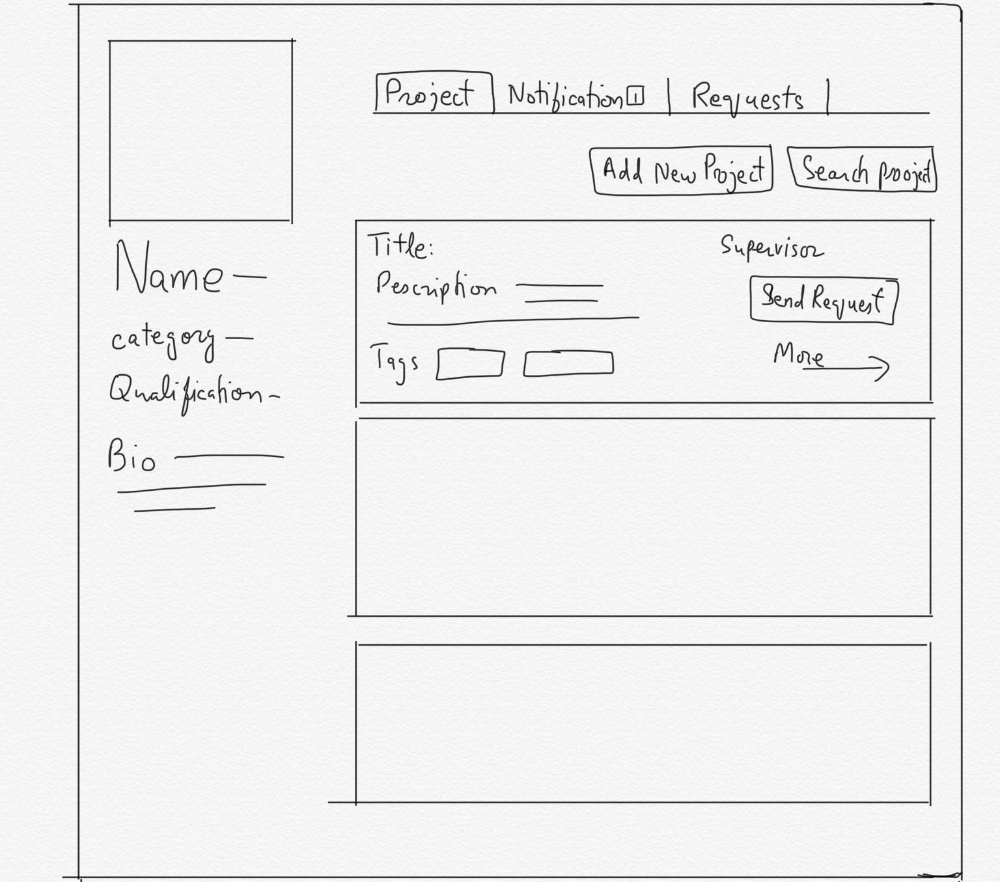
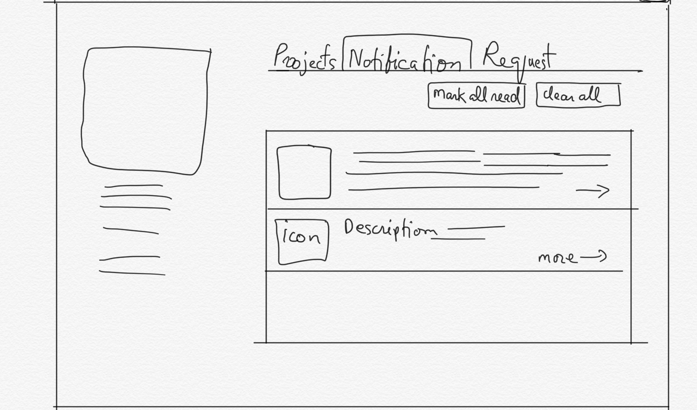
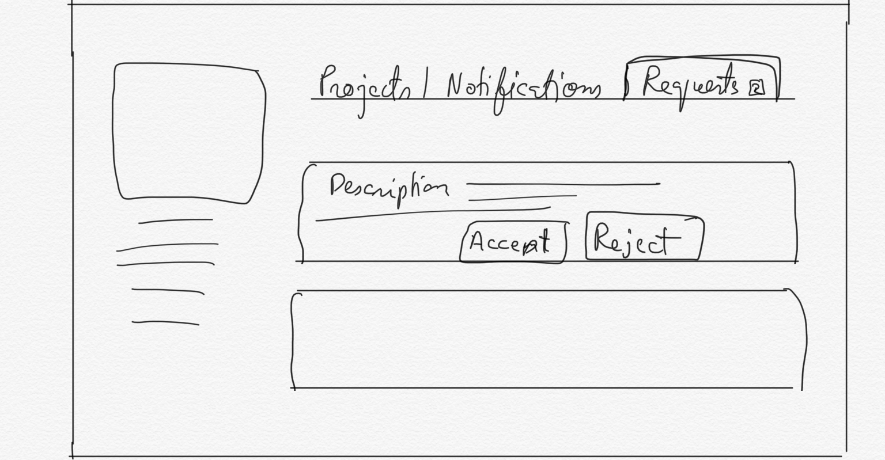
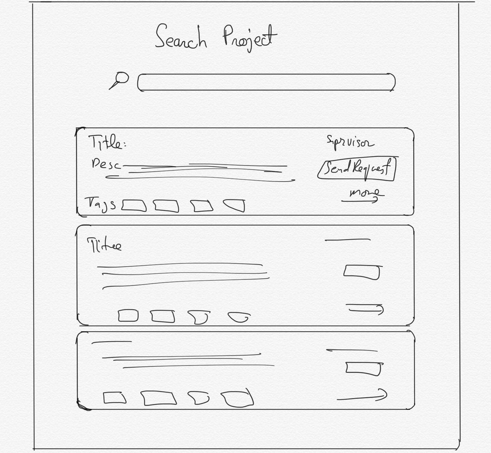
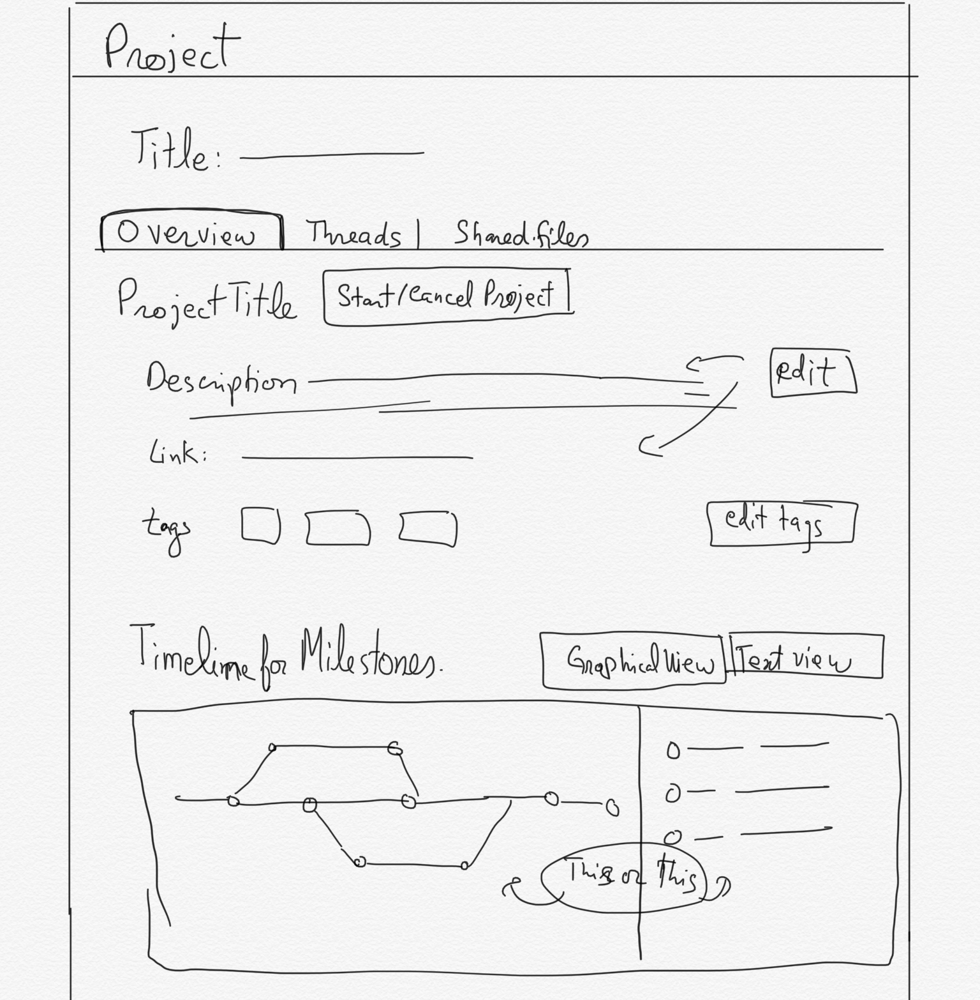
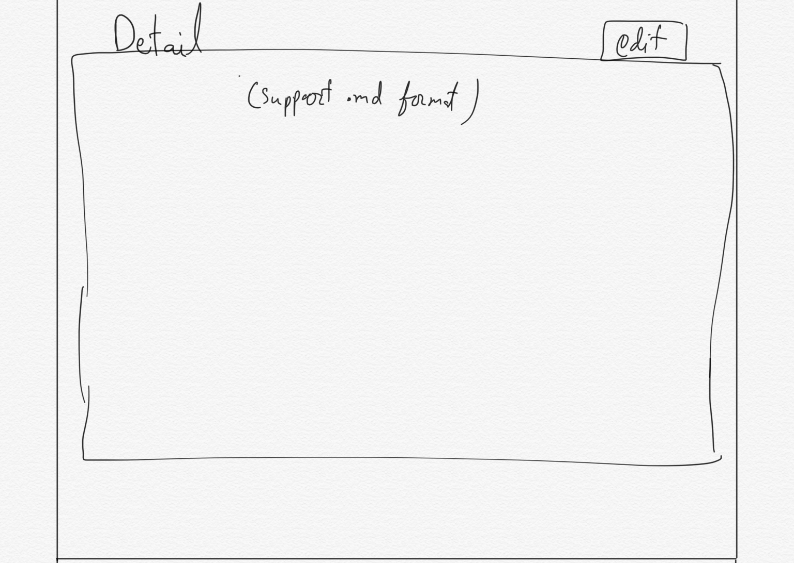
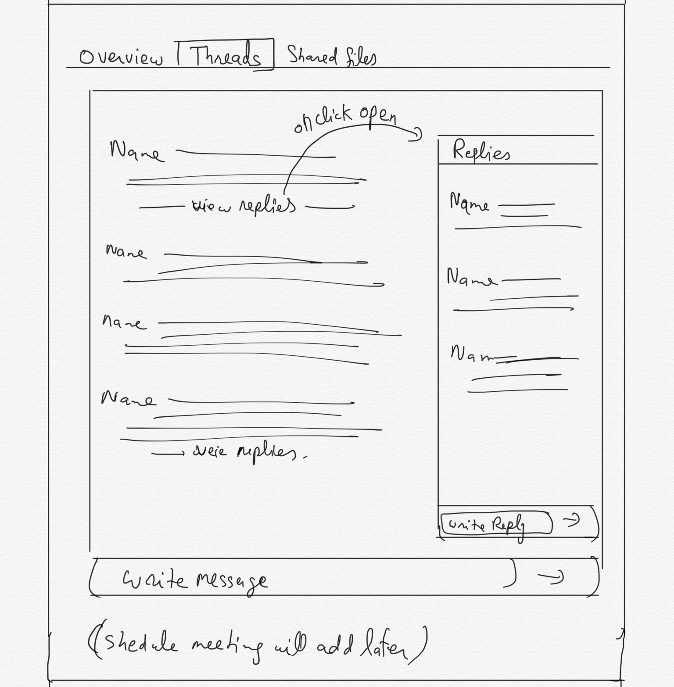
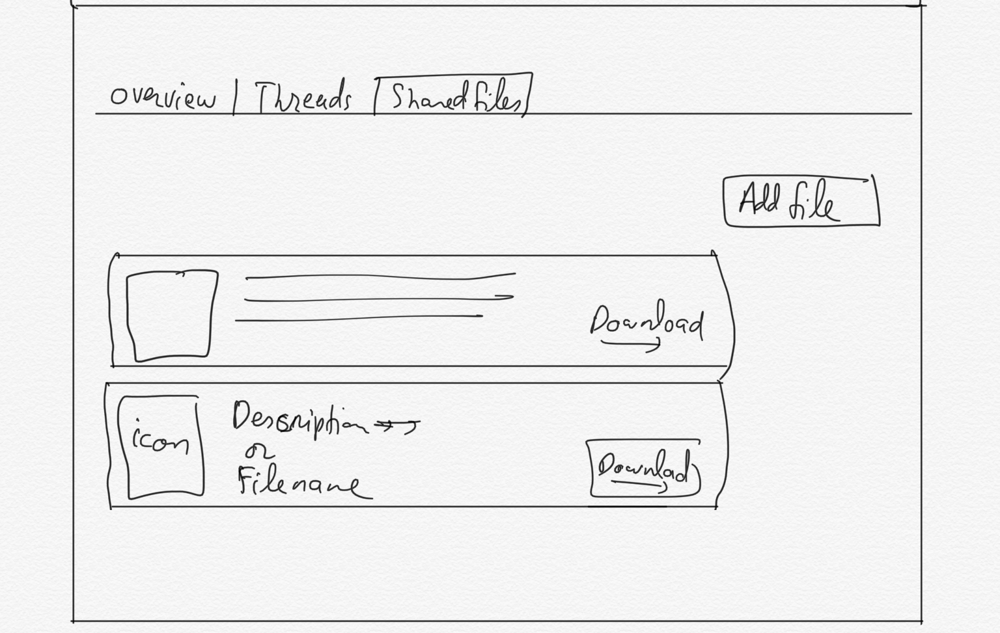

# Final Year Project Manager

WE ARE DEVELOPING A PROJECT MANAGMENT SYSTEM FOR STUDENTS.

---

## **Description**:

FYP-Manager is a web application that allows students to work together and manage their project, progress and meetings with supervisor remotely.
FYP-Manager aims to keep track of the project progess and milestone to be achieved timely, which is benificial for both parties (project supervisor and students). Usually teachers and professors have tough schedule. And they barely meet in their officies, FYP-Manager provides online platform, where supervisor can share any resource with the students who are doing his project anytime.

So what is does is:

- [x] Keep track of project progress
- [x] Saves times
- [x] Schedule meetings
- [x] Maintain resources
- [x] Let you focus on Goals and Milestones

**Technology stack**: | Bootstrap | Reactjs | Nodejs | MongoDB |

**Status**: Under development.

**Links to production or demo instances**

- [Landing Page]()
- [Web App]()

**Screenshot**: (Later)

---

## Table of Contents

- [Development Documentation](#development-documentation)
  - [How to start](#how-to-start)
  - [Code directory structure](#code-directory-structure)
  - [Requirements summary](#requirements-summary)
  - [Modules to work on](#modules-to-work-on)
- [Contribution](#Contribution)
  - [Getting involved](#getting-involved)
  - [Issues](#Issues)
  - [Credits and references](#credits-and-references)
- [Open source licensing info](#open-source-licensing-info)

---

# Development Documentation

## How to start

The setup instructions assume that you're using [Git Bash](https://git-scm.com/), but the concepts are the same if you're using [Git GUI](https://git-scm.com/downloads/guis) or another version control software.

1. To begin, fork the current ["FYP-Manager project repository"](https://github.com/hashirshoaeb/FYP-Manager/) on GitHub.

2. Clone the repository of your fork. Launch Git Bash, and use the following command. Replace `<your-username>` with your GitHub user name:

   ```sh
   git clone https://github.com/<your-username>/FYP-Manager.git
   ```

3. Move into the `FYP-Manager` directory with the following command:

   ```sh
   cd FYP-Manager
   ```

4. Assign the forked repository to a remote called "origin".

   ```sh
   git remote add origin git://github.com/<your-username>/FYP-Manager.git
   ```

5. Assign the original repository to a remote called "upstream".

   ```sh
   git remote add upstream https://github.com/hashirshoaeb/FYP-Manager.git
   ```

6. Install [frontend packages](#) with npm:

   ```sh
   npm install
   ```

7. Start dev server

   ```sh
   npm start
   ```

## Code directory structure

```bach
    FYP-Manager/
    |__ public/
    |   |__ index.html
    |__ src/
    |   |__ asserts/
    |   |       (images and stuff)
    |   |__ components/
    |   |   |__ website-components/
    |   |   |       (components for website)
    |   |   |__ webapp-componentes/
    |   |   |       (components for web-app)
    |   |__ App.css
    |   |       (global css file)
    |   |__ App.js
    |   |       (main frontend component)
    |   |__ index.js
                (main starting point)
```

## Requirements summary

- Entities
  - student (Team leader and members)
  - teacher (Supervisor and Co supervisor)
  - project
  - timeline (milestone)
  - stars
  - Notification
  - Authentication
  - log
- Student can view the list of projects.
- Student can request for a project.
- Student will have one project at a time
- Student will have a project timeline once it is accepted by a supervisor.
- Student can invite other students to make team.
- Teacher can approve one student for one project.
- Teacher can create project.
- Teacher who create project will be the supervisor for that project.
- Supervisor can send invitation to other teachers to be the co supervisor for his project.
- Team leader can set milestones.
- There will be an "issues" tab, where students and teachers can discuss issue,
- Anyone can raise issue.
- Who can add and set milestones?
- Who can schedule meetings?
- Project progress?
- Evaluation process?
- Notifications?

## Modules to work on

**Views:**

- [x] Navigation bar
- [x] MainBody
- [x] About FYP Section
- [x] Projects Section
- [x] How it works section
- [x] Sign in cards
- [x] Sign up cards
- [x] Footer note
- [ ] Static website routing
- [ ] Student profile
- [ ] Teacher profile
- [ ] Dashboard
- [ ] Progress component
- [ ] Timeline component
- [ ] Rate stars component
- [ ] Chat box component

User




Search Project


Project (start project)





**Models:**

- [ ] User data model

  ```json
  {
    "user": {
      "id": "Type: Number",
      "created_at": "Type: Date",
      "name": "",
      "bio": "",
      "qualification": "",
      "category": "",
      "notifications": "virtual",
      "requests": "virtual"
    }
  }
  ```

* [ ] Requests data model

  ```json
  {
    "request": {
      "id": "Type: Number",
      "created_at": "Type: Date",
      "from": "sender_id",
      "to": "receiver_id",
      "for": "project_id",
      "status": "accepted, rejected, pending"
    }
  }
  ```

- [ ] Notifications data model

  ```json
  {
    "notification": {
      "id": "Type: Number",
      "created_at": "Type: Date",
      "link": "",
      "description": "",
      "user_id": "for user"
    }
  }
  ```

* [ ] Milestone data model

  ```json
  {
    "milestone": {
      "id": "Type: Number",
      "created_at": "Type: Date",
      "start_day": "",
      "end_day": "",
      "total_days": "end_day - start_day",
      "title": "",
      "description": "",
      "is_achieved": "false default",
      "rating": " ",
      "project_id": "for project"
    }
  }
  ```

- [ ] Conversation data model

  ```json
  {
    "thread": {
      "id": "Type: Number",
      "created_at": "Type: Date",
      "project_id": "for project",
      "message": "",
      "user_id": "from user"
    }
  }
  ```

  ```json
  {
    "reply": {
      "id": "Type: Number",
      "created_at": "Type: Date",
      "thread_id": "for thread",
      "message": "",
      "user_id": "from user"
    }
  }
  ```

- [ ] Project data model

  ```json
  {
    "project": {
      "id": "Type: Number",
      "created_at": "Type: Date",
      "starting_date": "Type: Date. from this date progress will be started calculating",
      "title": "Type: String",
      "description": "",
      "link": "",
      "tags": "",
      "milestones": "virtual",
      "user_id": "owner of project",
      "team": "id's of collaborators",
      "threads": "virtual",
      "progress": "calculation from milestones"
    }
  }
  ```

**Controllers:**

# Contribution

Project is under development. Contributors are most welcomed to join. Feel free to ask question.

## Getting involved

1. Raise Issue, discuss fearture you want to fix
2. Fork repo
3. Fix it
4. Generate Pull Request

## Issues

- [ ] Fix readme.md to standard format
- [ ] Search functionality needs improvment

## Credits and references

- [How to write Readme](https://github.com/cfpb/open-source-project-template/blob/master/README.md)
- [React routing](https://reacttraining.com/react-router/web/guides/quick-start)

---

<table>
  <tr>
    <td align="center">
      <a href="https://www.facebook.com/hashir.shoaeb">
        
        <br />
        <sub><b>Hashir Shoaib</b></sub>
      </a>
      <br />
    </td>
    <td align="center">
      <a href="https://github.com/khizarkhizar">
        
        <br />
        <sub><b>Khizer Hayyat</b></sub>
      </a>
      <br />
    </td>
  </tr>
</table>

---

## Open source licensing info

[LICENSE](LICENSE)

```

```
